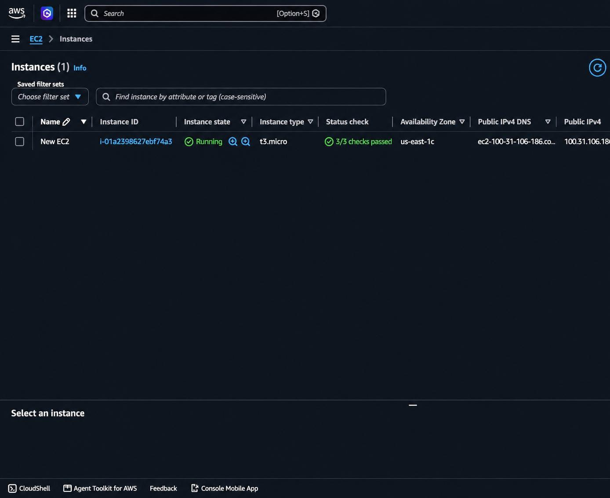
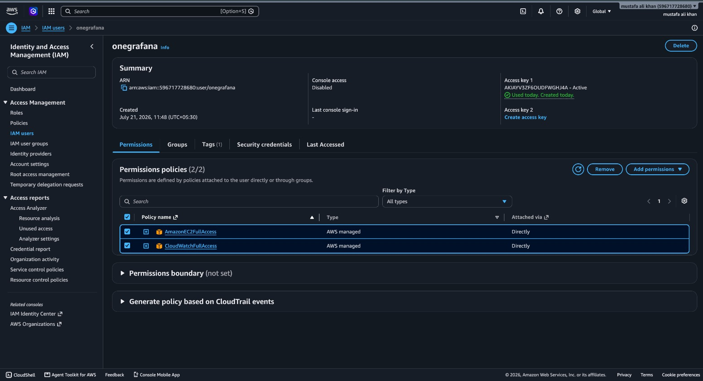
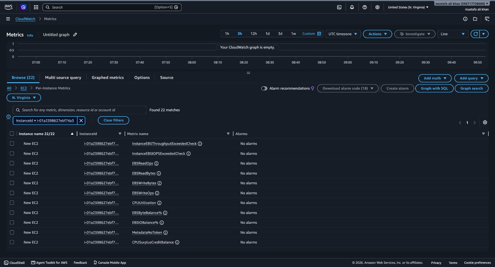
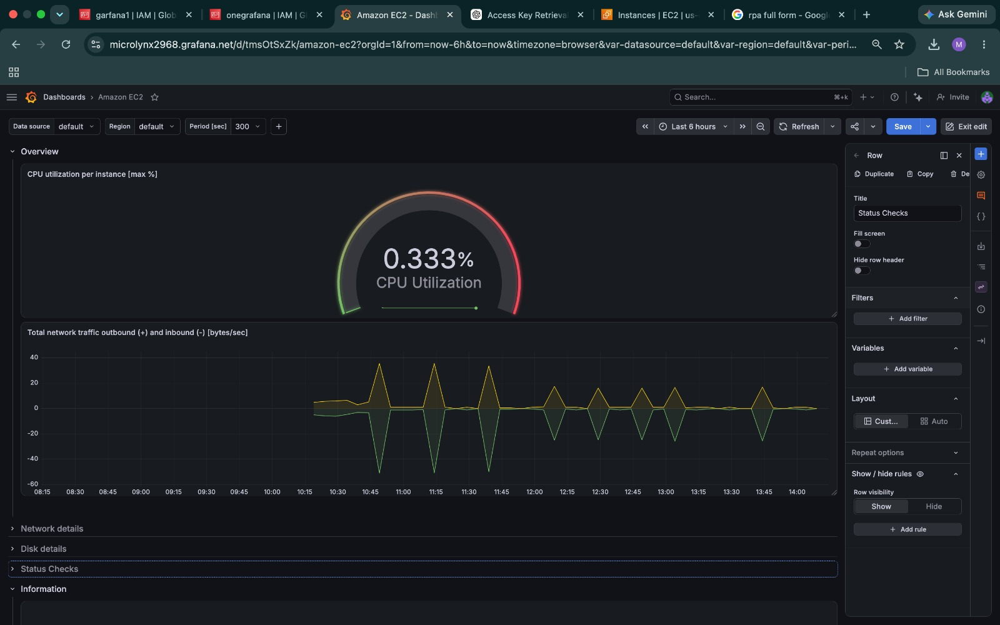
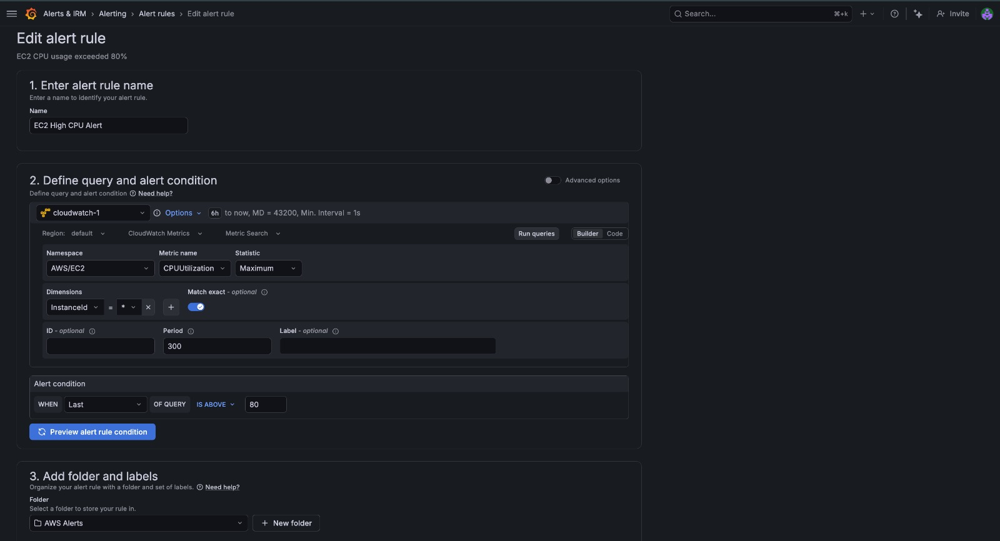
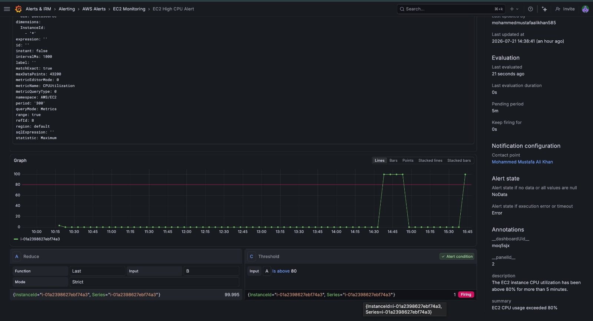
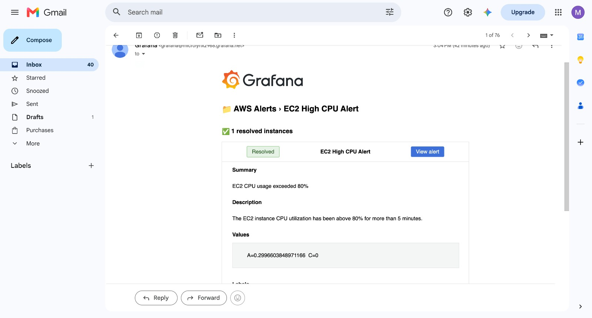

# AWS CloudWatch Monitoring with Grafana Cloud

## 📌 Project Overview

This project demonstrates how to monitor an Amazon EC2 instance using **Amazon CloudWatch** and **Grafana Cloud**. The monitoring dashboard provides real-time insights into EC2 performance metrics, and an alert rule sends an email notification whenever CPU utilization exceeds a defined threshold.

---

# 🏗️ Architecture

```text
                    +----------------------+
                    |    Amazon EC2        |
                    +----------+-----------+
                               |
                               | Performance Metrics
                               ▼
                    +----------------------+
                    |  Amazon CloudWatch   |
                    +----------+-----------+
                               |
                               | CloudWatch Data Source
                               ▼
                    +----------------------+
                    |    Grafana Cloud     |
                    +----------+-----------+
                               |
                +--------------+--------------+
                |                             |
                ▼                             ▼
        Monitoring Dashboard          Alert Rules
                                              |
                                              ▼
                                   Email Notification
```

---

# 🛠️ AWS Services Used

- Amazon EC2
- AWS IAM
- Amazon CloudWatch
- Grafana Cloud

---

# 📋 Prerequisites

Before starting, make sure you have:

- AWS Account
- Running EC2 Instance
- Grafana Cloud Account
- IAM User with CloudWatch and EC2 permissions

---

# 🚀 Implementation Steps

## Step 1: Launch an EC2 Instance

- Launch an Amazon EC2 instance.
- Choose Amazon Linux 2023 or Ubuntu.
- Configure the Security Group.
- Verify the instance is in the **Running** state.

**Screenshot**



---

## Step 2: Create an IAM User

- Create an IAM user.
- Attach the following AWS managed policies:
  - CloudWatchFullAccess
  - AmazonEC2FullAccess
- Generate an Access Key and Secret Access Key.

**Screenshot**



---

## Step 3: Verify CloudWatch Metrics

- Open Amazon CloudWatch.
- Navigate to **Metrics → EC2 → Per-Instance Metrics**.
- Verify that EC2 metrics are being collected.

**Screenshot**



---

## Step 4: Create a Grafana Dashboard

- Log in to Grafana Cloud.
- Configure Amazon CloudWatch as the data source.
- Create a dashboard.
- Add the **CPUUtilization** metric for the EC2 instance.

**Screenshot**



---

## Step 5: Configure a CPU Alert Rule

Create a Grafana-managed alert with the following configuration:

- Metric: CPUUtilization
- Threshold: Greater than **80%**
- Evaluation Interval: **1 minute**
- Pending Period: **5 minutes**

**Screenshot**



---

## Step 6: Verify Alert Status

Generate CPU load on the EC2 instance.

### Amazon Linux

```bash
sudo yum install stress -y
stress --cpu 2 --timeout 300
```

Verify that the alert status changes to **Firing**.

**Screenshot**



---

## Step 7: Verify Email Notification

Once the alert enters the **Firing** state, Grafana sends an email notification to the configured contact point.

**Screenshot**



---

# 📸 Project Screenshots

## 1. EC2 Instance

Launched an Amazon EC2 instance to host the monitoring environment.


---

## 2. IAM User

Created an IAM user with CloudWatch and EC2 permissions for Grafana Cloud integration.


---

## 3. CloudWatch Metrics

Verified that Amazon CloudWatch was collecting EC2 performance metrics.


---

## 4. Grafana Dashboard

Created a Grafana dashboard to visualize EC2 CPU utilization and other metrics.


---

## 5. CPU Alert Rule

Configured a Grafana-managed alert to trigger when CPU utilization exceeds 80%.


---

## 6. Alert Firing

Verified that the alert entered the **Firing** state after the threshold was exceeded.


---

## 7. Email Notification

Received an email notification from Grafana confirming the alert was triggered successfully.


---

# ✅ Results

- Successfully connected Grafana Cloud to Amazon CloudWatch.
- Verified CloudWatch metrics collection.
- Created a real-time Grafana dashboard.
- Configured CPU utilization alerts.
- Successfully triggered the alert.
- Received email notifications from Grafana.

---

# 💡 Skills Demonstrated

- Amazon EC2
- AWS IAM
- Amazon CloudWatch
- Grafana Cloud
- Cloud Monitoring
- Dashboard Creation
- Alert Management
- Email Notifications
- Infrastructure Monitoring

---

# 📚 Conclusion

This project demonstrates how to build a cloud monitoring and alerting solution using Amazon CloudWatch and Grafana Cloud. It provides real-time infrastructure monitoring, dashboard visualization, and automated email notifications for performance events.

---

## 👨‍💻 Author

**Mohammed Mustafa Ali Khan**

GitHub: **https://github.com/MohammedMustafaAliKhan85**
